# OneForAll MCP: The Future of AI Integration

The Centralized Platform for the AI Agentic Revolution

## The Rise of AI Agents & The Integration Challenge

AI agents are transforming industries, but their power depends on accessing external tools and data. The Model Context Protocol (MCP) is the new standard, the "USB-C for AI," but managing countless integrations creates a major bottleneck for developers.

### The Old Way: A Web of Complexity

Developers traditionally juggle multiple server connections, API keys, and integration points for each AI agent, leading to slow development cycles and high maintenance overhead.

```mermaid
graph TD
    A[🤖 AI Agent Client] --> B(Tool A)
    A --> C(Tool B)
    A --> D(Tool C)
```

### The Solution: OneForAll MCP

A single, unified platform that centralizes hundreds of tools, allows for custom tool creation, and provides access through one server link and one API key. Radically simple.

```mermaid
graph TD
    A[🤖 AI Agent Client] --> B[OneForAll MCP Server]
    B --> C(Tool A)
    B --> D(Tool B)
    B --> E(Tool C)
    B --> F(🛠️ Custom Tools)
```

### Key Features

    

        
200+

        
Pre-Built Tools

        
Access a vast library of ready-to-use tools covering common developer and business needs from day one.

    

    

        
🔑

        
Unified Access

        
One server link. One API key. Drastically simplify your AI agent's integration layer and reduce overhead.

    

    

        
💻

        
Custom Tooling

        
Need something specific? Write your own tools in any language and integrate them seamlessly into the platform.

    

    

        
🤝

        
Team Collaboration

        
Share custom and curated toolsets with your team or make them public to contribute to a growing ecosystem.

    

## A Hyper-Growth Market Opportunity

### Custom Software Market Growth

The demand for tailored, integrated software solutions is exploding, creating the perfect environment for a platform like OneForAll MCP. The market is projected to grow at a staggering 22.71% CAGR.

    <canvas id="marketGrowthChart"></canvas>

### Key Market Segments

Cloud solutions and large enterprises dominate the custom software landscape, validating OneForAll's focus on scalable, team-oriented, cloud-native features.

    <canvas id="marketShareChart"></canvas>

## How OneForAll Stands Out

While other platforms offer tool discovery or general automation, OneForAll is purpose-built for the MCP standard, providing a uniquely deep, flexible, and developer-centric solution for building next-generation AI agents.

| Platform        | Primary Focus       | Hosted Custom Code | Unified MCP Access |
| :-------------- | :------------------ | :----------------- | :----------------- |
| OneForAll MCP   | Centralized MCP Tools | ✔ Yes (Any Language) | ✔ Yes              |
| Zapier          | Workflow Automation | Limited (Web IDE)  | Beta Feature       |
| MCP Market      | MCP Server Directory | ✖ No               | ✖ No               |
| AWS Lambda      | Serverless Compute  | ✔ Yes (Various Languages) | ✖ No               |

## Security: Our Unshakable Foundation

The power of custom tooling comes with immense responsibility. We are committed to a "security-by-design" philosophy, implementing a multi-layered defense to protect our users and their data at every step.

#### 1. Code Execution Isolation

Untrusted code is executed in secure, isolated containers (sandboxes) with strictly limited privileges.

#### 2. Rigorous I/O Handling

All inputs are validated and sanitized to prevent injection attacks. Outputs are encoded to stop vulnerabilities.

#### 3. Principle of Least Privilege

Strong authentication and authorization grant tools only the minimum access required to function.

#### 4. End-to-End Encryption

Data is encrypted both in transit (using TLS) and at rest, protecting sensitive information.

#### 5. Continuous Monitoring

We constantly log and monitor system activity, traffic, and processes to detect and respond to threats in real-time.

## The Future is Agentic. The Future is Unified.

OneForAll MCP is more than a platform; it's an ecosystem designed to accelerate AI innovation. By removing the friction of integration and fostering a community of builders, we empower developers to create the next generation of intelligent applications faster and more securely than ever before.

[Join the Waitlist & Start Building](#)

© 2025 OneForAll MCP. All Rights Reserved.

This infographic is a conceptual visualization based on strategic analysis.

